 

Minimalist base-project for interactive graphical applications (2D/3D) 
Written in plain C++. For the original C variant, see [SlimEngine](https://github.com/HardCoreCodin/SlimEngine) 
Pure-software (no hardware acceleration) 
Focuses on simplicity, ease of use and setup with no dependencies and an optional single header file variant 
 
Built on: [SlimApp](https://github.com/HardCoreCodin/SlimApp)  
Used in: [SlimTracin](https://github.com/HardCoreCodin/SlimTracin)  

Architecture:
-
SlimEngine++ is platform-agnostic by design, though currently only supports Windows. 
The platform layer only uses operating-system headers - no standard library used. 
The application layer itself has no 3rd-party dependencies - only uses standard math headers. 
It is just a library that the platform layer uses - it has no knowledge of the platform. 

More details on this architecture [here](https://youtu.be/Ev_TeQmus68).

Usage:
-
The single header file variant includes everything. 
Alternatively, specific headers can be included from the directory of headers. 
 
All features are opt-in, only the entry point needs to be defined. 
It just needs to return a pointer to an instance of a SlimEngine derived class:  
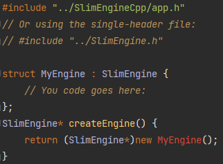  
On its own that yield a valid application with a well-behaved blank window. 
 
SlimEngine++ comes with pre-configured CMake targets for all examples. 
For manual builds on Windows, the typical system libraries need to be linked 
(winmm.lib, gdi32.lib, shell32.lib, user32.lib) and the SUBSYSTEM needs to be set to WINDOWS 

All examples were tested in all combinations of: 
Compiler: MSVC, MinGW, CLang 
Language: C++ 
CPU Arch: x86, x64 

Features:
-
SlimEngine++ extends SlimApp++ and so inherits all it's features 
Additional features include facilities for interactive 3D applications:  
* Scene with cameras, geometries, meshes and parametric curves 
* Scene selection with interactive transformations (moving, rotating and scaling) 
* Customizable Heads Up Display (HUD) 
* 3D Viewport with rich mouse/keyboard navigation 
* 3D Line drawing for wireframe rendering (optionally multi-sampled for very clean lines) 
 
  

Well documented example applications cover the features:  

* <b><u>Window:</b></u>  
  Renders a Canvas into its content:   
  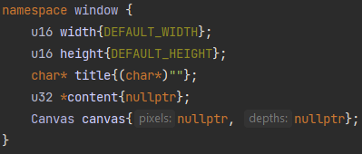  
   

* <b><u>HUD:</b></u>  
  A table of lines with Title and Value columns.   
  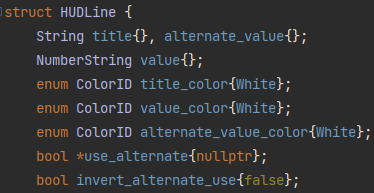  
  Values can be numeric or strings and can be bound to a boolean for toggling  
  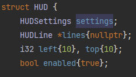  
  Line height and text color can be controlled globally or per line  
  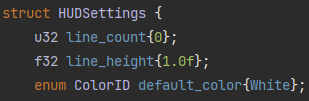  
  A typical setup might look like this:  
  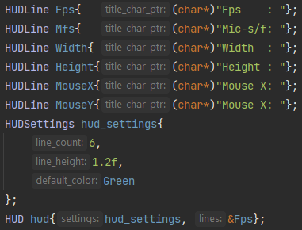  
  Updating the values may look like this:  
  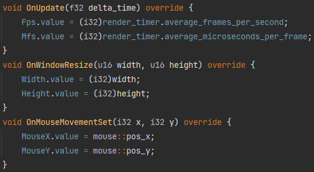  
  Toggled rendering might look like this:  
  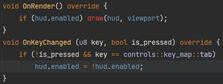  
   

* <b><u>Viewport:</b></u>  
    
  Binds to a Canvas and a Camera:   
  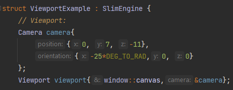  
  Used for all 3D geometry drawing:  
  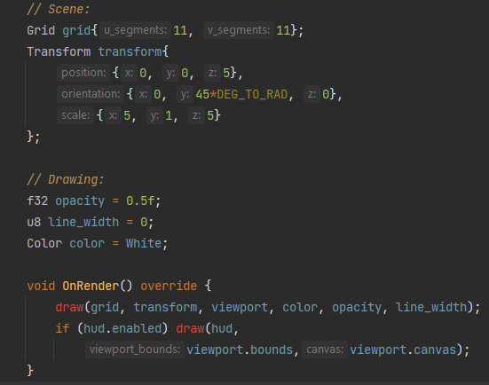  
  Can be made to resize with the window:  
  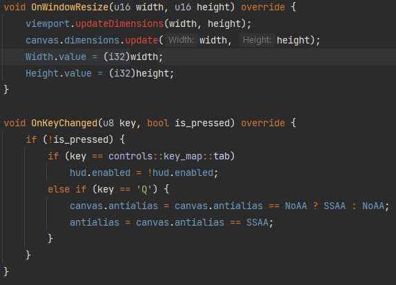  
   

* <b><u>Navigation</b>:</u>  
    
  Actions available for panning, zooming, dollying, orienting and orbiting the camera:  
    
  They compose to provide 1st person shooter or DCC orbiting style navigations:  
  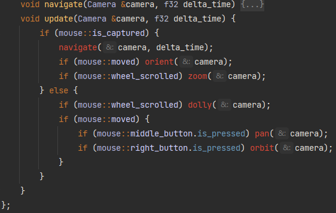  
  Navigation modes can be toggled through mouse capture tracking:  
  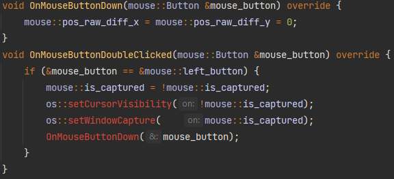  
  Keyboard navigation supports moving in any direction:  
  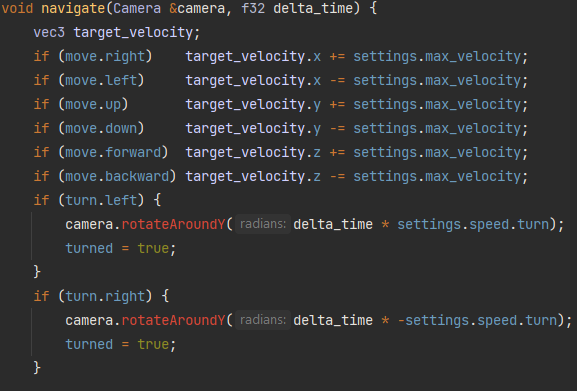  
  Movement has acceleration and deceleration:  
  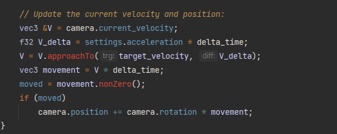  
  Navigation is agnostic to key-binding and is trivial to map keys to:  
  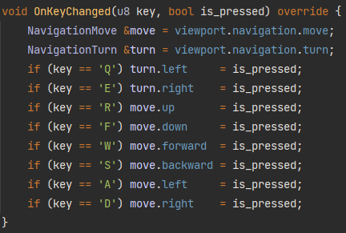  
  Navigation is enabled through the Viewport:  
  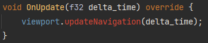  
   

* <b><u>Cameras</b>:</u>  
    
  There can be any number of cameras in a scene:  
  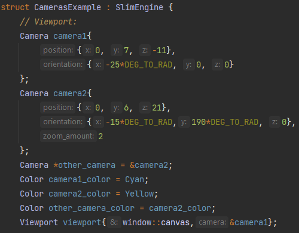   
  Different cameras can be (re)bound to any viewport at runtime:  
  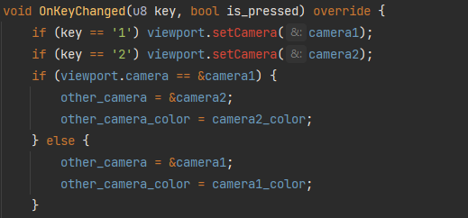  
  Cameras can also be drawn to a viewport:  
  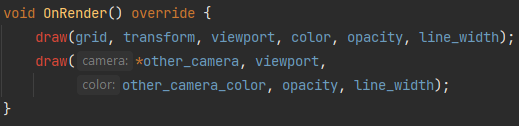  
   

* <b><u>Shapes</b>:</u>  
   
  Grids, Boxes and Curves contain their parameters, transforms are kept separately:  
  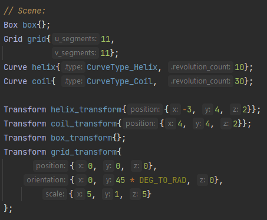  
  Transforms can be modified with ease:  
  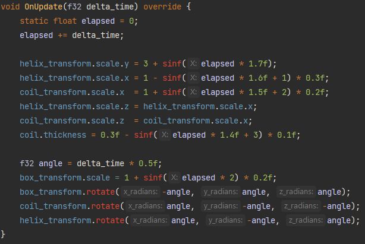  
  Wireframe viewport drawing is provided with transforms explicitly:  
  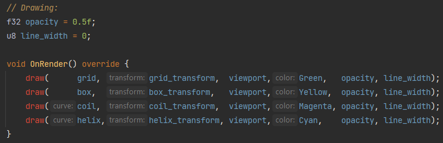  
   
  
* <b><u>Scene Selection and Manipulation</b>:</u>  
    
  Shapes and Transforms can compose into a Scene with Geometry objects:  
  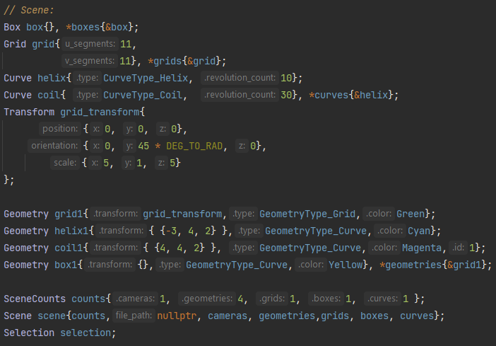  
  A scene Selection model can then be managed alongside a Scene. 
  Selected geometries can be dragged along the screen or transformed locally:  
  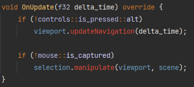  
  Selection highlights can be drawn to the viewport:  
  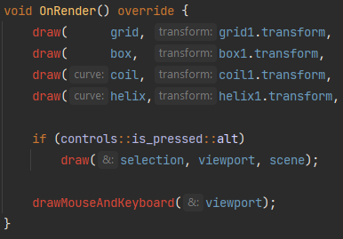  
   

* <b><u>Mesh</b>:</u>  
    
  Triangular meshes can be loaded from `.mesh` files containing vertex positions, normals and uvs.  
  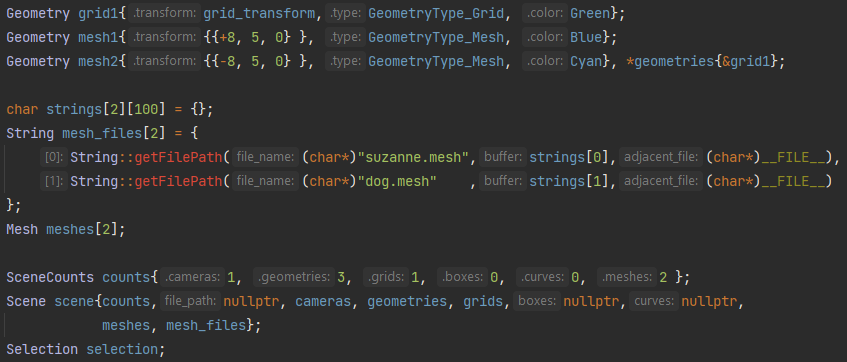  
  Meshes bind to Geometry objects with Transforms and are part of a Scene like any other geometry type. 
  Geometry objects can be rebound to different meshes at runtime:  
  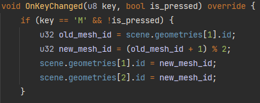  
  Meshes are instanced by having different Geometry objects bound to the same Mesh.  
    
  They can then be drawn in different colors and with different transforms:  
  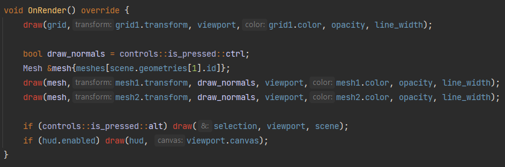  
   

* <b><u>Scene Save/Load</b>:</u>  
    
  A Scene can be associated with a `.scene` file:  
  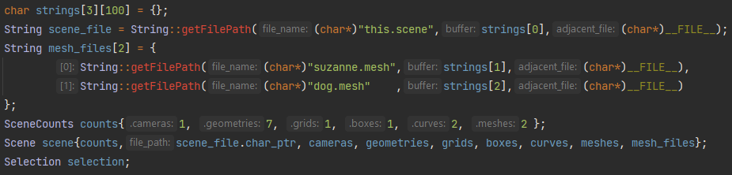  
  It can then be saved to and loaded back from that file (in-place):  
  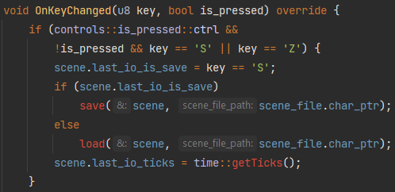  
  Saving and loading times are tracked for notification:  
  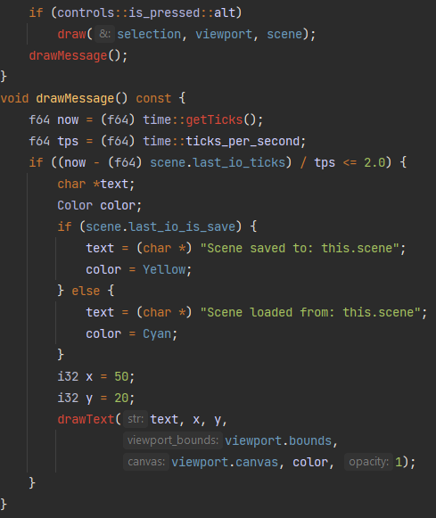  
   

* <b><u>obj2mesh</b>:</u> Also privided is a separate CLI tool for converting `.obj` files to `.mesh` files. 
  Usage: `./obj2mesh src.obj trg.mesh [-invert_winding_order] [scale_x:<float>] [rotY:<float>]` 
  - invert_winding_order : Reverses the vertex ordering (for objs exported with clockwise order) 
  - scale_x:\<float\>: Apply an embedded scaling 
  - rotY:\<float\>: Apply an embedded rotation around the Y axis 
  
<b>SlimEngine++</b> does not come with any GUI functionality at this point. 
Some example apps have an optional HUD that shows additional information. 
It can be toggled on or off using the`tab` key. 

All examples are interactive, having 2 interaction modes:
1. FPS navigation (WASD + mouse look + zooming) 
2. DCC application (default) 

Double clicking the `left mouse button` anywhere within the window toggles between these 2 modes.<btr>

Entering FPS mode captures the mouse movement for the window and hides the cursor. 
Navigation is then as in a typical first-person game (plus lateral movement and zooming): 

Move the `mouse` to freely look around (even if the cursor would leave the window border) 
Scroll the `mouse wheel` to zoom in and out (changes the field of view of the perspective) 
Hold `W` to move forward 
Hold `S` to move backward 
Hold `A` to move left 
Hold `D` to move right 
Hold `R` to move up 
Hold `F` to move down 

Exit this mode by double clicking the `left mouse button`.

The default interaction mode is similar to a typical DCC application (i.e: Maya): 
The mouse is not captured to the window and the cursor is visible. 
Holding the `right mouse button` and dragging the mouse orbits the camera around a target. 
Holding the `middle mouse button` and dragging the mouse pans the camera (left, right, up and down). 
Scrolling the `mouse wheel` dollys the camera forward and backward. 

Clicking the `left mouse button` selects an object in the scene that is under the cursor. 
Holding the `left mouse button` while hovering an object and then dragging the mouse, 
moves the object parallel to the screen. 

Holding `alt` highlights the currently selecte object by drawing a bounding box around it. 
While `alt` is still held, if the cursor hovers the selected object's bounding box, 
mouse interaction transforms the object along the plane of the bounding box that the cursor hovers on: 
Holding the `left mouse button` and dragging the mouse moves the object. 
Holding the `right mouse button` and dragging the mouse rotates the object. 
Holding the `middle mouse button` and dragging the mouse scales the object. 
<i>(`mouse wheel` interaction is disabled while `alt` is held)</i> 